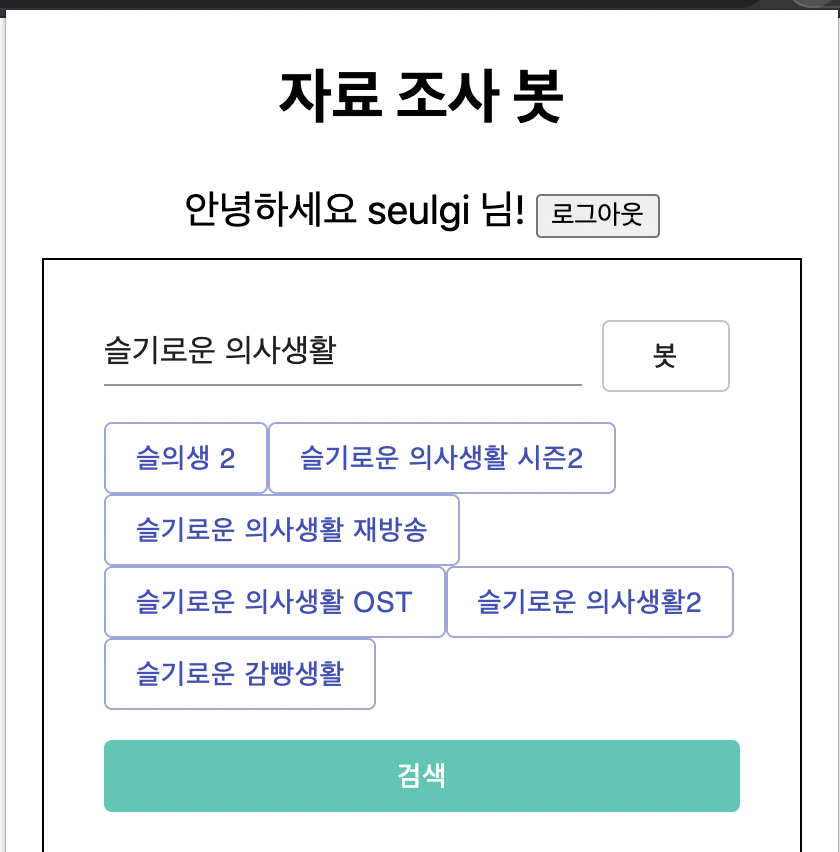
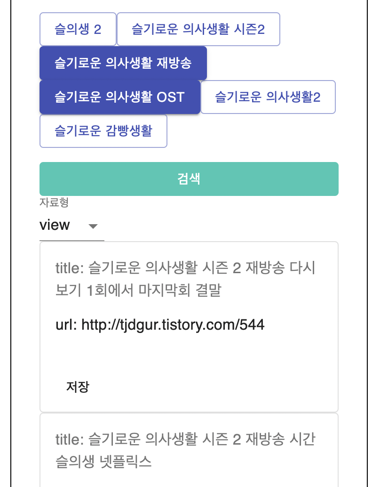
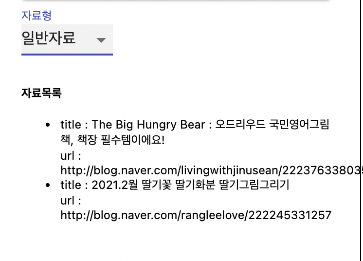
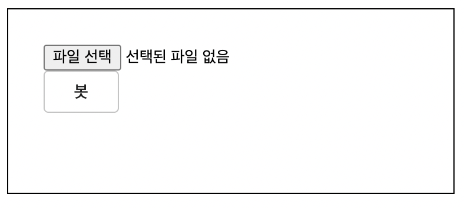
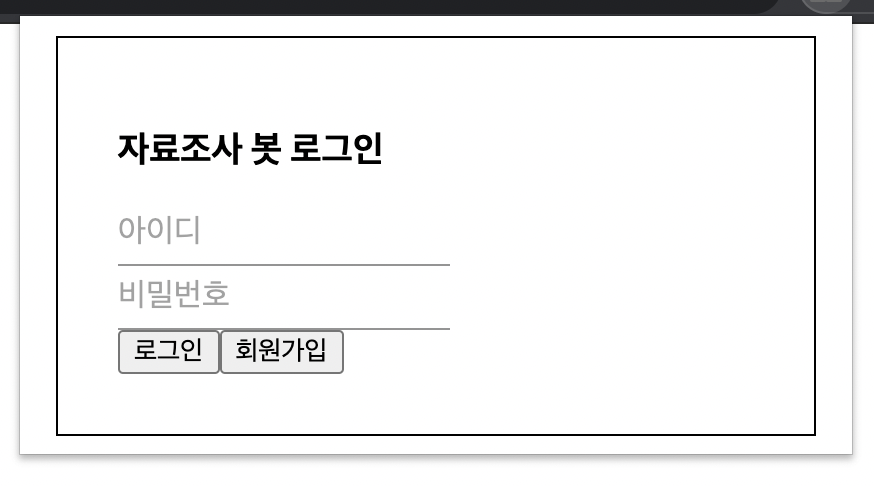

# CodeNation

## 팀 멤버
* 김선우
* 김성민
* 김예림
* 서지원
* 유유정
* 이슬기

## 개발 환경 및 스택, 모듈 소개
* React, Node.js, Mysql, Express
- proxy 1.0.2
- cheerio
- nodemon 2.0.7
- cookie-parser 1.4.5
- body-parser 1.4.5
- axios 0.21.1
- concurrently 4.0.1
- express 4.17.1
- dotenv 8.2.0
- cors 2.8.5
- promise 8.0.1

## 실행 방법
1. build
`cd client`을 한 뒤 `npm run build`

2. default brower
client/build/manifest.json에 default browser설정이 없다면 다음과 같은 코드를 작성한다.
```
"browser_action": {
    "default_popup": "./index.html"
  }
```

3. 확장 프로그램 관리
- 확장 프로그램 관리에서 개발자 모드로 전환한다.
- client/build폴더를 업로드한다.

## 자료조사봇

## 실행화면
1. 검색어 키워드 추출 기능 
</img>  
</img>  
검색어를 입력하고 봇 버튼을 클릭했을 때 그와 관련한 검색어가 뜨는 기능이다.
검색어를 중복선택해서 검색버튼을 클릭했을 때 자료형에 따라 맞는 자료를 검색해 보여주는 기능이다.  
</img>
자료 저장버튼을 누르면 저장된 자료목록에 자료가 저장되는 기능이다.

2. 자료 키워드 추출 기능  
</img>  
pdf, excel과 같은 자료를 넣으면 해당 키워드를 5개 추출해주는 기능이다.

3. 로그인  
</img>  
로그인 화면이다.

> 참고한 오픈소스
* [리액트 크롬익스텐션](https://github.com/satendra02/react-chrome-extension)
    : react 크롬익스텐션 개발 환경 설정이 설명되어있으니 참고해주세요
